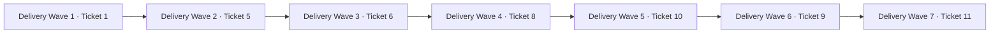

# Tasks: Complete Audio-First V1

**Input**: Design documents from `/specs/002-complete-v1/`

**Source tickets**: B-86 Tickets 1, 5, 6, 8, 10, 9, and 11. Ticket 7 is the accepted principal-review dependency.

**Tests**: Behavioral tests precede implementation at each new public seam. A RED task must fail for the declared missing behavior, not for setup or compilation.

**Public-source boundary**: Machine-specific receipts, package manifests, install evidence, rollback
evidence, and workload evidence named by historical tasks remain in the private qualification workspace.
The public source candidate omits those files; their historical paths identify the local evidence location,
not files that collaborators should expect in a source clone.

## Format: `[ID] [P?] [Story] Description`

- **[P]**: No Production task is marked parallel. The remaining work shares ordered contracts or state.
- **[Story]**: Maps to the user stories in `spec.md` and the source ticket shown in each phase.
- Each task receives one logical commit and one local check.

## Phase 1: User Story 1 — Reproduce the private local baseline (Ticket 1)

**Goal**: Close the rebrand and reproducibility foundation with current evidence.

**Independent Test**: A clean isolated checkout completes the documented setup, build, test, package, launch, provenance, license, and dry-run release seams on the target Mac.

- [x] T001 [US1] Define RED baseline guards for unresolved branch dependencies, model/binary provenance, license inventory, product branding, release inputs, and declared command coverage in `frontend/tests/lib/baseline.test.ts`, `frontend/tests/lib/provenance.test.ts`, `frontend/tests/lib/licenses.test.ts`, and `scripts/verify-baseline.sh` — check: `bun test frontend/tests/lib/baseline.test.ts frontend/tests/lib/provenance.test.ts frontend/tests/lib/licenses.test.ts` fails only for proven current gaps.
- [x] T002 [US1] Pin the Rust and Node toolchains; pin or remove every remaining moving dependency and distribution model/binary reference; normalize the canonical upstream; make the baseline verifier deterministic; and update inventories in `rust-toolchain.toml`, `.node-version`, `Cargo.toml`, `Cargo.lock`, `frontend/package.json`, `frontend/src-tauri/Cargo.toml`, `frontend/pnpm-lock.yaml`, `frontend/src-tauri/src/parakeet_engine/parakeet_engine.rs`, `frontend/src-tauri/build/ffmpeg.rs`, `.github/workflows/ci.yml`, `PROVENANCE.md`, `THIRD_PARTY_NOTICES.md`, `docs/BASELINE.md`, `docs/BUILDING.md`, `scripts/bootstrap-dev.sh`, and `scripts/verify-baseline.sh` — check: T001 focused tests plus `cargo metadata --locked --format-version 1` pass, the canonical remote is `https://github.com/Zackriya-Solutions/meetily.git`, and no declared source depends on a branch.
- [x] T003 [US1] Execute clean setup, full baseline gates, native launch, package build, and dry-run release on the target Mac; record non-sensitive observed results and immutable artifact hashes in `docs/BASELINE.md` and `specs/002-complete-v1/quickstart.md` — check: `scripts/verify-baseline.sh`, `pnpm --dir frontend tauri:build`, and `./scripts/release.sh --dry-run` pass from the exact T003 commit.

**Checkpoint**: Ticket 1 criteria are evidenced and the target baseline is fit for later Waves.

---

## Phase 2: User Story 2 — Qualify imported-audio transcription (Ticket 5)

**Goal**: Qualify the accepted Silero + Parakeet/Whisper + FluidAudio-diarization pipeline and make failure recovery durable.

**Independent Test**: The versioned local corpus passes declared quality/resource thresholds without network processing, and forced interruption or malformed output preserves the Recording and supports one safe retry.

- [x] T004 [US2] Define RED repository and command contract tests for durable processing jobs, restart recovery, duplicate-start rejection, language metadata, origin provenance, malformed diarization output, transactional transcript replacement, and source immutability in `frontend/src-tauri/src/database/repositories/processing_job.rs`, `frontend/src-tauri/src/audio/retranscription.rs`, and `frontend/src-tauri/migrations/20260815000000_add_processing_jobs.sql` — check: `cargo test processing_job --lib` fails only because the durable contract is absent.
- [x] T005 [US2] Implement the durable job state, language field, restart-safe state transitions, typed sanitized errors, input manifest hash, and atomic principal transcript replacement in `frontend/src-tauri/migrations/20260815000000_add_processing_jobs.sql`, `frontend/src-tauri/src/database/models.rs`, `frontend/src-tauri/src/database/repositories/processing_job.rs`, `frontend/src-tauri/src/database/repositories/mod.rs`, `frontend/src-tauri/src/audio/retranscription.rs`, and `frontend/src-tauri/src/lib.rs` — check: `cargo test processing_job --lib` and `cargo test retranscription --lib` pass.
- [x] T006 [US2] Add a deterministic private corpus manifest, generator, qualification runner, metric calculator, baseline threshold derivation, and shared redaction-safe receipt validator in `qualification/audio-corpus/manifest.json`, `qualification/audio-corpus/scripts/generate.sh`, `qualification/audio-corpus/scripts/qualify.sh`, `qualification/audio-corpus/scripts/measure.ts`, `qualification/validate-receipt.ts`, `qualification/audio-corpus/README.md`, and `frontend/tests/lib/audio-qualification.test.ts` — check: `bun test frontend/tests/lib/audio-qualification.test.ts` and a clean corpus regeneration produce identical manifest hashes.
- [x] T007 [US2] Replace FluidAudio first-run implicit downloads with an explicit verified local model installation and status boundary in `frontend/src-tauri/src/audio/diarization.rs`, `frontend/src-tauri/src/audio/diarization_models.rs`, `frontend/src-tauri/src/lib.rs`, `frontend/src/components/TranscriptSettings.tsx`, `frontend/src/types/index.ts`, `qualification/audio-corpus/model-manifest.json`, and `THIRD_PARTY_NOTICES.md` — check: focused Rust model-manifest tests reject missing/wrong hashes and ordinary processing performs no model download.
- [x] T008 [US2] Run every corpus category and failure case on the target Mac, set thresholds from measured baseline, verify the selected configuration, and record model/runtime versions plus non-sensitive results in `qualification/audio-corpus/results/target-mac.json`, `qualification/audio-corpus/README.md`, `docs/BASELINE.md`, and `specs/002-complete-v1/quickstart.md` — check: `qualification/audio-corpus/scripts/qualify.sh` passes with network observation empty during processing.
- [x] T009 [US2] Reconcile B-86 Ticket 5 and its implementation decisions with accepted ADR-0013, mark only evidenced criteria complete, and add the `specs/002-complete-v1/` pointer in the private agent-governance repository through an isolated worktree — check: the exact backlog commit names ADR-0013, preserves the original objective, and contains no unrelated governance-repository changes.

**Checkpoint**: Ticket 5 closes under accepted ADR-0013. B-86 stale wording is corrected in its owning backlog commit.

---

## Phase 3: User Story 3 — Align captured origins (Ticket 6)

**Goal**: Prove and repair live-origin processing into one provenance-preserving, seekable timeline.

**Independent Test**: Microphone, system, both-origin, silence, overlap, ambiguity, retry, and source-hash cases pass on the target Mac.

- [x] T010 [US3] Define RED captured-origin contract tests for independent processing, local-participant assignment, ordering, silence, overlap, ambiguity retention, duplicate-start behavior, immutable source hashes, and mixed-track seek tolerance in `frontend/src-tauri/src/audio/retranscription.rs`, `frontend/src-tauri/src/audio/recording_preferences.rs`, `frontend/src-tauri/src/database/repositories/transcript.rs`, and `frontend/tests/lib/automatic-post-recording-transcription.test.ts` — check: focused Rust and Bun tests fail only for current acceptance gaps.
- [x] T011 [US3] Fix only the failed captured-origin acceptance seams in `frontend/src-tauri/src/audio/retranscription.rs`, `frontend/src-tauri/src/audio/recording_preferences.rs`, `frontend/src-tauri/src/database/repositories/transcript.rs`, `frontend/src-tauri/src/audio/recording_saver.rs`, `frontend/src/hooks/useRecordingStop.ts`, and `frontend/src/types/index.ts` — check: T010 focused Rust and Bun tests pass and stored source hashes remain unchanged.
- [x] T012 [US3] Execute native microphone-only, system-only, both-origin, source-loss, silence, overlap, ambiguity, retry, and timestamp-seek UAT; record results in `qualification/captured-timeline/target-mac.json`, `docs/BASELINE.md`, and `specs/002-complete-v1/quickstart.md` — check: `bun qualification/validate-receipt.ts qualification/captured-timeline/target-mac.json` passes, seek error is at most 100 ms, and network/log observations contain no private Session data.

**Checkpoint**: Ticket 6 closes. Ticket 7 remains valid against the qualified timeline.

---

## Phase 4: User Story 4 — Generate grounded local findings (Ticket 8)

**Goal**: Generate typed Meeting, Interview, or Content findings locally through Apple Foundation Models with strict evidence resolution and no fallback.

**Independent Test**: Each record type produces validated current evidence; unavailable, malformed, stale, concurrent, cancelled, and helper-death cases leave the Session safe and create no network request.

- [x] T013 [US4] Define RED canonical-record, generation-schema, evidence-resolution, revision-staleness, unavailable, malformed, timeout, concurrency, and helper-protocol tests in `frontend/src-tauri/src/verifiable_record/models.rs`, `frontend/src-tauri/src/verifiable_record/repository.rs`, `frontend/src-tauri/src/verifiable_record/apple_foundation.rs`, `foundation-helper/Tests/FoundationHelperTests/FoundationHelperTests.swift`, and `frontend/tests/lib/verifiable-record.test.ts` — check: focused Rust, Swift, and Bun tests fail only for the absent Ticket 8 contract.
- [x] T014 [US4] Implement the versioned `VerifiableRecord` read model and local generation persistence in `frontend/src-tauri/migrations/20260816000000_add_verifiable_record.sql`, `frontend/src-tauri/src/verifiable_record/models.rs`, `frontend/src-tauri/src/verifiable_record/repository.rs`, `frontend/src-tauri/src/verifiable_record/commands.rs`, `frontend/src-tauri/src/verifiable_record/mod.rs`, `frontend/src-tauri/src/database/repositories/mod.rs`, and `frontend/src-tauri/src/lib.rs` — check: canonical snapshot, schema, evidence, stale-revision, and transaction tests pass.
- [x] T015 [US4] Implement and bundle the one-request NDJSON Apple Foundation Models helper with guided generation and typed availability in `foundation-helper/Package.swift`, `foundation-helper/Sources/FoundationHelper/main.swift`, `foundation-helper/Tests/FoundationHelperTests/FoundationHelperTests.swift`, `scripts/prepare-foundation-helper.sh`, `frontend/src-tauri/src/verifiable_record/apple_foundation.rs`, `frontend/src-tauri/tauri.conf.json`, and `.github/workflows/ci.yml` — check: `swift test --package-path foundation-helper` plus focused Rust protocol tests pass on available and unavailable fixtures.
- [x] T016 [US4] Implement fixed record-type selection, current/stale generation state, grounded findings, evidence seek actions, and accessible unavailable/failure UI; remove the legacy llama/Ollama V1 controls and package path in `frontend/src/types/verifiable-record.ts`, `frontend/src/hooks/meeting-details/useVerifiableRecord.ts`, `frontend/src/components/MeetingDetails/EvidenceStatusPanel.tsx`, `frontend/src/components/MeetingDetails/SummaryPanel.tsx`, `frontend/src/app/meeting-details/page-content.tsx`, `frontend/src/components/SummaryModelSettings.tsx`, `frontend/src-tauri/src/summary/summary_engine/mod.rs`, `frontend/src-tauri/src/summary/summary_engine/client.rs`, `frontend/src-tauri/src/summary/summary_engine/commands.rs`, `frontend/src-tauri/src/summary/summary_engine/model_manager.rs`, `frontend/src-tauri/src/summary/summary_engine/models.rs`, `frontend/src-tauri/src/summary/summary_engine/sidecar.rs`, `llama-helper/Cargo.toml`, `llama-helper/src/main.rs`, `frontend/src-tauri/src/lib.rs`, `frontend/src-tauri/tauri.conf.json`, `Cargo.toml`, and `scripts/prepare-sidecar.sh` — check: focused Bun tests, `pnpm --dir frontend exec tsc --noEmit`, and `pnpm --dir frontend build` pass with no V2 llama control or shipped helper.
- [x] T017 [US4] Execute Meeting, Interview, Content, stale revision, invalid evidence, model unavailable, Apple Intelligence disabled, unsupported locale, context limit, cancellation, helper death, and zero-network-fallback UAT; record the receipt in `qualification/local-findings/target-mac.json` and `specs/002-complete-v1/quickstart.md` — check: `bun qualification/validate-receipt.ts qualification/local-findings/target-mac.json` resolves 100% of grounded evidence and observes zero external request.

**Checkpoint**: Ticket 8 closes. One canonical record contract exists for export and provider preview.

---

## Phase 5: User Story 5 — Export the current Agent Handoff (Ticket 10)

**Goal**: Produce equivalent current Markdown and JSON through explicit native save or share.

**Independent Test**: All three record types pass semantic equivalence, stale-artifact, cancel, write-failure, field-exclusion, and temporary-cleanup tests.

- [x] T018 [US5] Define RED pure serializer and native destination contract tests for all record types, complete transcript inclusion, semantic equivalence, current revision, forbidden fields, cancellation, unsafe destination, write failure, and temporary cleanup in `frontend/src-tauri/src/agent_handoff.rs` and `frontend/tests/lib/agent-handoff.test.ts` — check: focused Rust and Bun tests fail only because the export contract is absent.
- [x] T019 [US5] Implement canonical JSON and Markdown serializers plus atomic Finder-save and macOS-share commands in `frontend/src-tauri/src/agent_handoff.rs`, `frontend/src-tauri/src/lib.rs`, `frontend/src-tauri/Cargo.toml`, and `frontend/src-tauri/tauri.conf.json` — check: focused Rust tests prove semantic equivalence and no incomplete artifact after every failure.
- [x] T020 [US5] Add the accessible Agent Handoff action to the accepted Session workspace in `frontend/src/components/MeetingDetails/AgentHandoffMenu.tsx`, `frontend/src/app/meeting-details/page-content.tsx`, `frontend/src/types/verifiable-record.ts`, and `frontend/tests/lib/agent-handoff.test.ts` — check: focused Bun tests, TypeScript, and Next build pass.
- [x] T021 [US5] Execute native save, share, cancellation, overwrite, unwritable destination, stale prior export, temporary cleanup, and content-scan UAT; record results in `qualification/agent-handoff/target-mac.json` and `specs/002-complete-v1/quickstart.md` — check: `bun qualification/validate-receipt.ts qualification/agent-handoff/target-mac.json` reports equivalent JSON/Markdown facts and zero forbidden fields.

**Checkpoint**: Ticket 10 closes. The canonical handoff contract is fixed before provider transmission.

---

## Phase 6: User Story 6 — Authorize an optional provider (Ticket 9)

**Goal**: Keep secrets in Keychain and require exact one-use confirmation before every external transfer.

**Independent Test**: Keychain lifecycle, legacy migration, task enablement, preview, cancellation, payload equality, provenance, failure, and manual retry pass with no secret exposure or fallback.

- [x] T022 [US6] Define RED Keychain, legacy-secret migration, masked status, task authorization, server-side preview digest, one-use confirmation, exact payload, cancellation, provenance, failure, and no-fallback tests in `frontend/src-tauri/src/providers/keychain.rs`, `frontend/src-tauri/src/providers/repository.rs`, `frontend/src-tauri/src/providers/commands.rs`, `frontend/src-tauri/migrations/20260817000000_add_provider_authorization.sql`, and `frontend/tests/lib/provider-authorization.test.ts` — check: focused Rust and Bun tests fail only for the absent Ticket 9 contract. Evidence: RED `66565ba19a520550c53db1ac6158a2bb68fdadc1`; later security REDs `e51a9b7c0960f91f35510c7225eb20333ed86f34`, `98cf4b30d704314612e446350e0fa9c406656dc0`, and modal RED `ea1f527ac48bb238bd8320ff391d350d5934ae21` each failed only at their declared public seam.
- [x] T023 [US6] Implement the direct macOS Keychain adapter, idempotent legacy plaintext migration, secret-free provider/task state, and Settings lifecycle UI in `frontend/src-tauri/Cargo.toml`, `Cargo.lock`, `frontend/src-tauri/src/providers/keychain.rs`, `frontend/src-tauri/src/providers/repository.rs`, `frontend/src-tauri/src/providers/mod.rs`, `frontend/src-tauri/src/database/repositories/setting.rs`, `frontend/src-tauri/src/api/api.rs`, `frontend/src-tauri/migrations/20260817000000_add_provider_authorization.sql`, `frontend/src/components/ExternalProviderSettings.tsx`, `frontend/src/app/settings/page.tsx`, and `frontend/src/contexts/ConfigContext.tsx` — check: focused Keychain/migration tests pass and DB/UI/log scans contain no complete credential. Evidence: GREEN `dc7dc4240fde214987dd4fac7d361ab78a640f74`, startup recovery `7c4869ce5e06751c48bd14b3a2a2179c09cbb21a`, persisted Settings `a1f599a793083ca1abbe7430854a383b915ef916`, secure replacement/migration `e44fdcb7402942c3a78033e2296381d3ed4b5110`, task-specific Keychain isolation `d5abc0e901f74439166edb67b6806e1d9b1a4189`, durable physical purge `7279fe2278ee7359ed790e8ca2d49e933c7573b5`, first-launch migration `0b45789c953826a9471fcbca10aabf6d1a86bce5`, and bound retry/fresh-only initialization `2b601511edd1eca250d44a70559e9f73cab0a820` through `069d1079294eca80b3659183f3e0aa421b1c51a6`; final native DB, export, log, and UI scans observed zero complete synthetic credentials.
- [x] T024 [US6] Implement server-built preview, digest validation, one-use confirmation, exact adapter send, separate external result, and transfer provenance in `frontend/src-tauri/src/providers/commands.rs`, `frontend/src-tauri/src/providers/repository.rs`, `frontend/src-tauri/src/providers/mod.rs`, `frontend/src-tauri/src/summary/llm_client.rs`, and `frontend/src-tauri/src/lib.rs` — check: provider test-double tests prove exact payload, no video, one send, no automatic retry, no substitution, and separate provenance. Evidence: GREEN `257b6e0e3b25ef4e61e7a78c532f0e5d37dcf99d` plus hardened redirect, destination, replacement, credential-isolation, full-snapshot CAS, and durable outcome-unknown lifecycle in `e44fdcb7402942c3a78033e2296381d3ed4b5110`, `d5abc0e901f74439166edb67b6806e1d9b1a4189`, `2a9b0ccfe624d6df4bb1c7579e21ec9d5611cba0`, and `782c3f3141990f62c046921b5441bbc2f83aa6b1`; focused Rust provider tests passed 10/10.
- [x] T025 [US6] Implement the accessible confirmation and result UI in `frontend/src/components/MeetingDetails/ExternalTransferDialog.tsx`, `frontend/src/hooks/meeting-details/useExternalProvider.ts`, `frontend/src/app/meeting-details/page-content.tsx`, `frontend/src/types/verifiable-record.ts`, and `frontend/tests/lib/provider-authorization.test.ts` — check: focused Bun tests, TypeScript, and Next build pass; cancellation never invokes send. Evidence: GREEN `68984fcf31faadf3e049db5c700fdefdbe84f675`; native modal regression fixed by `cc7b150a53f36949ad76d1af046b0093e812d946` and non-retryable `outcome_unknown` guidance by `782c3f3141990f62c046921b5441bbc2f83aa6b1`; focused Bun 4/4, TypeScript, Next build, and independent exact-candidate review passed.
- [x] T026 [US6] Execute isolated Keychain save/test/replace/remove, legacy migration, enable/disable, cancellation, changed-snapshot, provider failure, explicit retry, exact-payload, secret-scan, and no-fallback UAT; record results in `qualification/provider-authorization/target-mac.json` and `specs/002-complete-v1/quickstart.md` — check: `bun qualification/validate-receipt.ts qualification/provider-authorization/target-mac.json` observes zero cancellation socket, one authorized send, and zero secret in DB/export/log/UI snapshots. Evidence: exact candidate `069d1079294eca80b3659183f3e0aa421b1c51a6`; application SHA-256 `20f3262a62762551af1438a4eddba9ecd446cacd128f7574c4043e5b53449fc2`; installer SHA-256 `ee03bd28a770b82dbfdc71b1c0022e269829a592a8fd742d7e295b451ab466db`; Mac15,12 / Apple M3 / 24 GiB / arm64 / macOS 26.5.2 (25F84) native replay passed locked-Keychain same-source retry, import/fresh rejection, Settings persistence, task authorization, cancel=0, exact send=1, typed failure with no automatic retry, explicit retry, non-retryable `outcome_unknown`, replacement/removal cleanup, and zero complete synthetic credential across DB/export/log/UI scans; login Keychain plus System search list was restored exactly and the isolated state was removed recoverably.

**Checkpoint**: Ticket 9 closes. External work remains optional, explicit, and inactive by default.

---

## Phase 7: User Story 7 — Qualify and accept complete V1 (Ticket 11)

**Goal**: Produce one reproducible, private, installable, rollback-capable V1 and obtain user acceptance.

**Independent Test**: The exact release candidate completes both primary workflows and every declared safety case on the target Mac without Terminal use.

- [x] T027 [US7] Consolidate the complete normal, boundary, failure, concurrency, privacy, performance, packaging, install, and rollback case table plus deterministic receipt validation in `qualification/v1/cases.json`, `qualification/v1/validate.ts`, `qualification/v1/README.md`, and `frontend/tests/lib/v1-qualification.test.ts` — check: `bun test frontend/tests/lib/v1-qualification.test.ts` fails only for unexecuted or failed required rows. Evidence: contract commit `25222c20b17511935d03651c4bdc697ef4f7039d`; closed synthetic CLI and forged-receipt seams passed 5/5, while the integrated seam failed only for the 40 required T028 rows recorded as `expected`; public notarized distribution remained `unsatisfied`.
- [x] T028 [US7] Execute the full suite, long capture/import processing, resource measurements, abrupt/graceful interruption, disk-risk, network observation, diagnostic scan, release package, clean install, both end-to-end seams, and rollback; record exact results and artifact hashes in `qualification/v1/target-mac.json`, `docs/BASELINE.md`, and `specs/002-complete-v1/quickstart.md` — check: full Rust, Swift, Bun, TypeScript, Next, package, receipt, install, and rollback gates pass for one exact package candidate, with long workloads reusable only through recorded change-impact equivalence that proves no runtime, UI, or audio source changed. Evidence: candidate `a067c8e8769597a89075aa0d48c0218bbc8296d1`; receipt valid; integrated gate passed; two clean packages passed; four install/rollback modes passed; final executable SHA-256 `75259cc42bacea949ce0fbc07b20ce2cdac4db1f51aa57383a24f9304fe83b5b`; DMG SHA-256 `14bc47a640123cf5bbe7d32a7f53f8a988ee3a586a5a5772e1b0be553d7b1b70`.
- [x] T029 [US7] Complete final keyboard/accessibility and no-Terminal user acceptance and record the reviewed release pointer in `specs/002-complete-v1/tasks.md`, `specs/002-complete-v1/quickstart.md`, and `docs/BASELINE.md` — check: independent review passes the exact gcrdings candidate, all required receipt rows are closed, and the user accepts the installed workflow. Evidence: ordinary review and separate Security Review passed source candidate `1030c68ef576e6a8fc379106e07102ade1d1f373`; External Assurance candidate `37385ab4d62a065f2848117edde66426601321cc086ec855caf315d12f8787c1` passed all four selected controls with no accepted risk; the operator accepted the V1 and no-Terminal workflow on 2026-08-17.
- [x] T030 [US7] Reconcile and close all B-86 criteria, status, and release pointers in the private agent-governance repository through an isolated worktree — check: the exact backlog commit closes B-86, preserves unrelated backlog state, and points to the accepted gcrdings release commit. Evidence: governance commit `f94e82589af28aa604f03ce4e18f1317a08dceb5` archives B-86 as `done` with 64/64 criteria and removes it from the open board; the unrelated `research/` worktree content remained untouched.

**Checkpoint**: Ticket 11 and B-86 close. V1 is finished and the session can be closed.

---

## Dependencies & Delivery Waves

| Delivery Wave | Source ticket | Tasks | Entry gate | Exit gate |
|---|---:|---|---|---|
| 1 | 1 | T001–T003 | `main` plus accepted plan | Reproducible packaged baseline |
| 2 | 5 | T004–T009 | Wave 1 | Qualified imported-audio pipeline and reconciled backlog contract |
| 3 | 6 | T010–T012 | Waves 1–2 and accepted capture | Qualified captured-origin timeline |
| 4 | 8 | T013–T017 | Wave 3 and accepted Ticket 7 | Grounded local findings |
| 5 | 10 | T018–T021 | Wave 4 canonical record | Equivalent explicit handoff export |
| 6 | 9 | T022–T026 | Wave 5 canonical handoff contract | Explicit Keychain-backed provider transfer |
| 7 | 11 | T027–T030 | Waves 1–6 | Accepted reproducible V1 release and closed backlog objective |

Tickets 9 and 10 are intentionally serialized. Both change `frontend/src/app/meeting-details/page-content.tsx`, `frontend/src-tauri/src/lib.rs`, and the canonical Session snapshot contract. Ticket 10 runs first so provider preview can select from a fixed contract.

## Execution Waves

No Production tasks are parallel. Each frontier contains one task because each next task consumes the previous task's tested contract or receipt.

- **EW01–EW03**: T001, then T002, then T003
- **EW04–EW09**: T004, then T005, then T006, then T007, then T008, then T009
- **EW10–EW12**: T010, then T011, then T012
- **EW13–EW17**: T013, then T014, then T015, then T016, then T017
- **EW18–EW21**: T018, then T019, then T020, then T021
- **EW22–EW26**: T022, then T023, then T024, then T025, then T026
- **EW27–EW30**: T027, then T028, then T029, then T030

For every Delivery Wave: integrate task commits in order, run focused checks per commit, run the relevant full suite once, close writes, invoke one independent read-only review against the fixed base, perform native UAT, then merge locally to `main`. A rejection consumes the second and final Production attempt for that objective.

## Execution Evidence

Append one row only after the named commit and check exist. Derive SHA from Git.

| Task | Commit | Subject | Local check | Observed result |
|---|---|---|---|---|
| T001 | `d06c78e` | `test(v1): define reproducible baseline gaps` | Focused Bun RED | 13 passed; 4 failed only for the measured gaps. |
| T002 | `20c2179` | `fix(v1): pin reproducible baseline inputs` | `scripts/verify-baseline.sh` | 17 passed; locked Rust and npm license resolution passed. |
| T003 | `d31d7bf` | `test(v1): preserve provenance references` | Verifier, package, release dry-run, native launch | Required checks passed; inherited red gates and package hashes recorded in the receipt. |
| T004 | `74f1442` | `test(v1): define durable processing job contract` | Focused Rust RED | Contract tests failed only for the absent durable job behavior. |
| T005 | `1a6646c` | `feat(v1): make retranscription jobs durable` | Focused and full Rust | Processing jobs 5/5; retranscription 29/29; full library 249 passed, 2 ignored. |
| T006 | `ccbb87f` | `test(v1): add deterministic audio qualification corpus` | Focused Bun and clean regeneration | 5 passed, 66 assertions; eight WAV files regenerated identically. |
| T007 | `53f3c19` | `feat(v1): install verified diarization models` | Focused Rust, bridge compile, TypeScript | Model tests 7/7; vendor bridge and TypeScript passed; independent review passed. |
| T008 fix | `c0c34ff` | `fix(v1): enforce speaker qualification coverage` | Focused Rust, Bun, TypeScript, package, native UAT | Partial assignments are atomic failures; strict overlap and three-speaker cases passed. |
| T008 | `dce404d` | `test(v1): requalify speaker and overlap coverage` | Native corpus and failure UAT | All speech cases matched the expected speaker count; overlap was explicit; network and diagnostic matches were zero. |
| T008 gate | `246074c` | `fix(v1): close qualification receipt schema` | Focused Bun and forged-receipt checks | Closed audio schema rejects credentials, unknown receipt types, and inconsistent passed thresholds. |
| T008 policy | `0be196f` | `fix(v1): bind receipt to manifest policy` | Focused Bun, forged provenance, and policy checks | Passed receipts require bounded thresholds, fixed command semantics, both manifest hashes, and zero safety failures. |
| T009 | `2a0d1e2` | `docs(backlog): record strict ticket 5 qualification` | Isolated backlog diff | ADR-0013 and the remediated receipt pointer are recorded; one backlog file changed. |
| T010 | `05dfd90` | `test(v1): define captured timeline contract` | Detached focused Rust and Bun RED | Rust failed at the absent origin-discovery seam; the system-only UI gate failed while four sibling cases passed. |
| T011 | `0f43185` | `fix(v1): preserve declared capture origins` | Focused and full Rust, Bun, TypeScript | Full Rust 254 passed/2 ignored; full Bun 73 passed; TypeScript passed. |
| T011 startup RED | `b55b205` | `test(v1): capture silent system-only start gap` | Focused Rust RED | Silent system-only startup reproduced the missing acceptance behavior. |
| T011 startup | `f2a31eb` | `fix(v1): allow silent system-only startup` | Focused Rust and native UAT | System-only capture started before output samples arrived and later retained the synthetic passage. |
| T012 schema | `e6c984b` | `test(v1): define captured timeline receipt` | Focused Bun | Captured-timeline receipt and forged-receipt cases passed. |
| T011 ambiguity RED | `e8b27a8` | `test(v1): capture punctuation ambiguity gap` | Focused Rust RED | Native punctuation variation reproduced the missing ambiguity marker. |
| T011 ambiguity | `343b8cf` | `fix(v1): normalize ambiguous transcript punctuation` | Focused Rust, package, native UAT | Both native origins share one ambiguity group and explicit preservation decision. |
| T012 | `1ee70dd` | `test(v1): qualify captured timeline on target Mac` | Native UAT and receipt validator | Nine capture cases passed; seek error was 10 ms; source hashes were unchanged; network and diagnostic matches were zero. |
| T011 review RED | `3ee4ecb` | `test(v1): close captured timeline review gaps` | Focused Rust and Bun RED | Partial-origin status, closed receipt evidence, and canonical Unicode ambiguity cases reproduced the review findings. |
| T011 review | `825840a` | `fix(v1): close captured timeline review blockers` | Focused Rust, Bun, TypeScript, package, native retry | Closed metadata status and receipt schemas passed; canonical ambiguity retained two passages; source hashes were unchanged. |
| T012 review | `58b88a7` | `test(v1): requalify captured timeline review fixes` | Native retry and receipt validator | Exact corrected code candidate retained two origin passages and one ambiguity group; receipt validation passed. |
| T012 type RED | `884fadb` | `test(v1): reject malformed source-loss origins` | Focused Bun RED | A wrong-type origin set reproduced a validator exception at the source-loss trust boundary. |
| T012 type | `1a2eab4` | `fix(v1): handle malformed source-loss origins` | Focused Bun and TypeScript | Wrong-type origin sets return closed validation errors; receipt and TypeScript checks pass. |
| T012 case RED | `863ebf8` | `test(v1): reject unknown captured timeline cases` | Focused Bun RED | An unknown case identifier reproduced a validator exception at the closed case-set boundary. |
| T012 case | `c5f0d11` | `fix(v1): reject unknown captured timeline cases` | Focused Bun and TypeScript | Unknown case identifiers return closed validation errors; receipt and TypeScript checks pass. |
| T013 | `a2caa12` | `test(v1): define local findings contract` | Focused Rust, Swift, and Bun RED | Rust compiled with one supporting test passing and five absent-contract failures; Swift 0/2 and Bun 0/2 failed only at the new contract seams. |
| T014 | `d1cf3a3` | `feat(v1): persist canonical verifiable records` | Focused Rust | Model 2/2 and repository 4/4 tests passed for canonical state, evidence, CAS, concurrency, and cancellation. |
| T015 | `667c3da` | `feat(v1): generate findings with Apple models` | Swift, focused Rust, bundle preparation | Swift 3/3 and Rust protocol 3/3 passed; the target-triple Foundation Models helper was prepared successfully. |
| T016 | `84f8ce7` | `feat(v1): deliver grounded local findings` | Full Rust, Swift, Bun, TypeScript, Next build | Rust 252 passed/2 ignored plus 2 doc-tests; Swift 4/4; Bun 79/79; TypeScript and production build passed. |
| T017 | `3e90f69`–`41eabcc`, `ba5319c`–`b3b2f82` | `test/fix(v1): qualify and harden grounded local findings` | Native UAT, full Rust, Swift, Bun, TypeScript, package, receipt validator | Exact evidence resolved; helper I/O is bounded and typed; restart and cancellation races recover safely; receipt identity is closed; zero external requests were observed. |
| T018 | `669356d` | `test(v1): define Agent Handoff contract` | Focused Rust and Bun RED | Rust 0/5 and Bun 0/2 failed only at the absent serializer, destination, request, and Session-menu seams. |
| T019 | `beb41dc` | `feat(v1): export canonical Agent Handoff` | Focused and full Rust | Agent Handoff 5/5; full Rust 268 passed, 2 ignored, plus 2 integration tests. |
| T020 | `022f92c` | `feat(v1): expose Agent Handoff actions` | Focused and full Bun, TypeScript, Next build | Focused Bun 2/2; full Bun 84/84; TypeScript and production build passed. |
| T021 receipt RED | `267ddd5` | `test(v1): define Agent Handoff receipt` | Focused Bun RED | The receipt validator rejected the absent Agent Handoff contract. |
| T021 validator | `df26da3` | `feat(v1): validate Agent Handoff receipts` | Focused Bun | Closed candidate, artifact, observation, and case validation passed. |
| T021 migration RED/GREEN | `07f4090`, `8023636` | `test/fix(v1): preserve applied migration bytes` | Live database startup, full Rust and Bun | The packaged app reproduced and then closed the SQLx checksum panic; Rust 268 passed plus 2 integration tests, and Bun 87/87 passed. |
| T021 snapshot race | `762b04a`, `3b881b6` | `test/fix(v1): export current selected destination` | Focused and full Rust | A Session update during destination selection now exports the post-selection canonical snapshot; Agent Handoff 7/7 and full Rust passed. |
| T021 target binding | `2e16917`, `3460aaf` | `test/fix(v1): pin qualification target` | Focused and full Bun | Forged hardware/OS targets now fail closed; full Bun passed. |
| T021 callback ordering | `f43f3e6`, `4ef3a59` | `test/fix(v1): close menu before native dialog` | Focused/full Bun, TypeScript, Next build, native package | Callback ordering tests passed, but exact-package UAT still observed the Radix menu accessibility tree when the native dialog was requested; the later committed-close fix supersedes this attempt. |
| T021 snapshot consistency | `b9cf367`, `b8e6b16` | `test/fix(v1): read one Verifiable Record snapshot` | Deterministic two-connection SQLite interleaving, focused/full Rust | RED observed revision 2 mixed with new participant and transcript state plus stale generation; GREEN reads all canonical record fields in one transaction. Focused Verifiable Record tests passed 22/22 and full Rust passed 271 with 2 ignored plus 2 integration tests. |
| T021 committed native ordering | `47a24ec`, `611f1dd` | `test/fix(v1): wait for committed handoff menu close` | Focused/full Bun, TypeScript, Next build, native package | A pending action starts exactly once from an effect only after `open=false` is committed; focused Bun passed 3/3 and full Bun passed 88/88. |
| T021 native UAT | `611f1dd` | `qualification/agent-handoff/target-mac.json` | Native save/share/cancel/failure UAT, semantic comparison, package hashes, code signing, receipt validator | Finder save and both share formats were operable; revision 6 outputs were equivalent and current; cancellation and write failure preserved the Session; zero forbidden fields, stale text, temporary artifacts, and TCP sockets were observed. |
| T027 | `25222c2` | `test(v1): define complete release qualification` | Focused Bun contract and forged-receipt checks | Closed contract seams passed 5/5 with 28 assertions; the integrated run retained one expected RED containing exactly the 40 unexecuted T028 cases, while `public_notarized` remained `unsatisfied`. |
| T031 | `fb60337` | `test(v1): define release safety blockers` | Focused release-safety Bun contract | The public contract passed the existing T027 assertions and failed only for the four declared T032–T035 blocker families. |
| T032 | `9da5ecb` | `fix(audio): execute verified FFmpeg copy` | Focused Rust plus exact integrated gate | Verified bundled-copy execution and all fail-closed FFmpeg seams passed. |
| T033 | `a067c8e` package | `scripts/build-local-adhoc.sh` | Two clean builds and three package-verifier runs | Both fixed-input builds were independently valid. Final executable SHA-256 is `75259cc4…`; DMG SHA-256 is `14bc47a6…`. |
| T034 | `a067c8e` gate | `scripts/verify-release-gates.sh` | Exact integrated gate | Rust 328 passed/2 ignored; Bun 113 passed; Swift, lint, TypeScript, Next, audits, and exact-package verification passed. |
| T035 | `a067c8e` package | `scripts/qualify-local-adhoc-install.sh` | Four target-Mac modes | Clean, existing-data, rollback, and interrupted rollback passed with zero cleanup delta. |
| T028 | `a067c8e` | `qualification/v1/target-mac.json` | Closed receipt validator | All 40 required rows passed; `public_notarized` remained unsatisfied. Long runtime metrics are bound by the recorded `4c76cd6..a067c8e` change-impact proof. |
| T029 | `1030c68` | Ordinary review, Security Review, Release Gate, operator acceptance | Exact-candidate assurance and human gate | Both independent reviews passed, all four assurance controls passed with no accepted risk, and the operator accepted the V1 and no-Terminal workflow on 2026-08-17. |

## Implementation Strategy

1. Merge this accepted plan to local `main`.
2. Execute Delivery Wave 1 in a new isolated worktree.
3. Stop after each Delivery Wave for integrated review, native UAT, evidence, backlog reconciliation, and local `main` merge.
4. Do not push or publish without a configured gcrdings remote and separate operator authority.

## Phase 8: Convergence — Release safety prerequisites for Ticket 11

**Convergence finding**: T027–T030 describe the integrated release outcome, but T028 is not safe to execute until production FFmpeg is fail-closed, each package is bound to fixed inputs and a closed verifier, strict quality/security gates are green, rollback is deterministic, and the Distribution Intent profile selects the correct assurance controls. These are release blockers within User Story 7, not new product scope.

**Required serial order**: T027 → T031 → T032 → T033 → T034 → T035 → T036 → T028 → T029 → T030. T028 is blocked by the verified commits and checks for T027 and T031–T036; no task in this chain is parallel.

**T027 pre-measurement contract addendum**: Before any T028 measurement, `qualification/v1/cases.json` and `qualification/v1/README.md` MUST fix the following pass thresholds and measurement boundaries: 30-minute live capture and 30-minute import; startup ≤15 s; graceful shutdown ≤5 s; 10,000-block initial render ≤5 s; 10,000-block interaction p95 ≤200 ms; RSS growth ≤512 MiB across each long workload; the existing imported-audio peak ≤1970 MB; and macOS thermal state never `serious` or `critical`. The no-admin energy proxy is `/usr/bin/top -l 1 -pid <app-pid> -stats pid,cpu,mem,power`, sampled every 5 seconds over each long workload; T027 MUST fix the parsed `POWER` aggregation, sample-count rule, and numeric pass ceiling in the contract before T028. Missing samples or an unavailable metric fail the row. Distribution mode is exactly `local_adhoc`; public notarized distribution is a separate conditional row that remains `unsatisfied` and MUST never be accepted as passed from ad-hoc signing or local installation evidence.

- [x] T031 [US7] Commit the RED release-safety and package contract at public seams in `frontend/tests/lib/v1-release-safety.test.ts`, `qualification/v1/cases.json`, `qualification/v1/package-allowlist.json`, and `qualification/v1/README.md`; cover the fixed T027 thresholds and energy proxy, bundled-only FFmpeg, builder-path leakage, closed package membership, required legal/provenance/source-offer artifacts, strict gates, `local_adhoc`, the always-unsatisfied public-notarized conditional, and rollback evidence — check: `bun test frontend/tests/lib/v1-release-safety.test.ts` fails only for the proven T032–T035 gaps while the T027 receipt-schema tests still pass. Commit exactly once with the RED contract.
- [x] T032 [US7] Make production FFmpeg fail closed in `frontend/src-tauri/build/ffmpeg.rs`, `frontend/src-tauri/src/audio/ffmpeg.rs`, `frontend/src-tauri/Cargo.toml`, and `Cargo.lock`: build accepts only the pinned, hash-verified local binary; packaged runtime accepts only its bundled binary; missing, substituted, or corrupt binaries return a typed sanitized failure; remove runtime download and PATH/home/current-directory/shell-profile fallback — check: `cargo test -p gcrdings ffmpeg --lib --locked` passes missing/corrupt/PATH-shadow/network-denial cases and the T031 test retains only T033–T035 failures. Commit exactly once.

  **VERIFIED (2026-08-17)**: Commit `9da5ecb` closes the later source-swap finding by executing a private verified copy instead of a mutable bundle path. Focused checks and the exact integrated candidate gate passed.
- [x] T033 [US7] Make each `local_adhoc` package fixed-input, traceable, and closed in `scripts/build-local-adhoc.sh`, `scripts/prepare-foundation-helper.sh`, `scripts/verify-release-package.sh`, `qualification/v1/package-allowlist.json`, `frontend/src-tauri/tauri.conf.json`, `LICENSE.md`, `THIRD_PARTY_NOTICES.md`, `PROVENANCE.md`, and `SOURCE_OFFER.md`: remap Rust and Swift builder paths, build from locked inputs, reject every package member outside the allowlist, ship the four legal/provenance artifacts, scan binaries/resources for private builder paths and forbidden content, and record each clean build's exact toolchain, dependency, member, and output identities without requiring cross-build byte equality — check: two clean builds each pass `scripts/verify-release-package.sh <app-path> <dmg-path>`, their observed hashes are recorded, and forged extra-file, missing-notice, path-leak, stale-candidate, and changed-manifest fixtures fail closed. Commit exactly once.

  **SUPERSEDED BLOCKER (2026-08-16)**: Three Rust/LLVM families produced independently valid packages with unequal normalized main executables. The operator replaced cross-build byte equality with the fixed-input, exact-provenance, independently verified build contract in FR-022 and SC-012. The earlier measurements remain evidence; they are not reinterpreted as equality.

  **VERIFIED (2026-08-17)**: Commit `5299fbb` removes normalized cross-build executable comparison. Two clean builds remained mandatory. Both exact-candidate manifests and packages passed independent verification.
- [x] T034 [US7] Close the strict quality and security gates consistently in `frontend/eslint.config.mjs`, `frontend/package.json`, `frontend/pnpm-lock.yaml`, `Cargo.toml`, `Cargo.lock`, `.github/workflows/ci.yml`, `scripts/verify-release-gates.sh`, and `scripts/release.sh`: unattended `cargo fmt --all --check`, `cargo clippy --workspace --all-targets --locked -- -D warnings`, frontend lint, full Rust/Swift/Bun/TypeScript/Next checks, `cargo audit`, `pnpm audit --audit-level high`, package verification, and dry-run release MUST all fail closed without unreviewed ignores — check: `scripts/verify-release-gates.sh` and the CI/release command-parity assertions in `frontend/tests/lib/v1-release-safety.test.ts` pass from frozen lockfiles. Commit exactly once.

  **REOPENED (2026-08-16)**: Earlier gates passed, but independent review found that the audit filter did not close warning policy and that the structural Clippy allowance was count-based. Commit `db5c078` replaces the Clippy baseline with exact site-scoped exceptions. The audit warning policy and final independent acceptance were still open at that checkpoint.

  **VERIFIED (2026-08-17)**: Commit `17f1989` blocks every reachable vulnerability and every unreviewed, changed, stale, duplicate, malformed, or expired warning. The exact integrated gate passed with zero reachable Rust vulnerabilities, seven current exact warning reviews, and zero high or critical npm vulnerabilities.
- [x] T035 [US7] Add the deterministic `local_adhoc` install and data-snapshot rollback harness in `scripts/qualify-local-adhoc-install.sh`, `qualification/v1/rollback-manifest.schema.json`, `qualification/v1/README.md`, and `frontend/tests/lib/v1-release-safety.test.ts`: snapshot the existing application bundle and application-data tree without following aliases, hash and SQLite-check the immutable snapshot, install/launch/stop the exact candidate, restore through staged atomic replacement, verify byte and database equality, and clean mounts/processes/listeners/temp state on success, cancellation, failure, and interrupted retry without administrator access — check: fixture runs prove install, failed launch, migration failure, insufficient disk, interrupted rollback, and already-installed cases; `bun test frontend/tests/lib/v1-release-safety.test.ts` passes with distribution `local_adhoc`, while the public-notarized row remains `unsatisfied`. Commit exactly once.

  **REOPENED (2026-08-16)**: Independent review found incomplete crash durability, busy SQLite writer handling, previous-process displaced-state recovery, symlink-ancestor validation, process-group cleanup, and receipt binding. Those findings governed the corrective implementation below.

  **IMPLEMENTED, REVIEW PENDING (2026-08-16)**: Commit `bde9b10` closes the review findings plus macOS Bash 3.2 portability and exact recovery-candidate binding. The RED seams reproduced both failures. The self-test passed 16/16 and the focused release-safety seam passed 4/4 in 8.02 seconds; final independent acceptance was still pending at that checkpoint.

  **VERIFIED (2026-08-17)**: Clean install, existing-data install, rollback, and interrupted rollback passed on the exact package with zero cleanup delta. Ordinary review, Security Review, Release Gate, and operator acceptance then passed.
- [x] T036 [US7] Add the single root `.external-assurance.json` profile for private GitHub source collaboration, local artifact access, collaborator build authority, macOS, and no update mechanism — check: the External Assurance controls decision selects exactly the four universal controls, returns no conditional claim, and performs no external effect. Commit exactly once.

  **IMPLEMENTED (2026-08-16)**: Commit `f82d219` records the confirmed profile. The controls decision passed with exactly `EA-CORE-001`, `EA-CORE-CLEAN-BUILD-GUIDANCE`, `EA-CORE-DEPENDENCIES-LICENSES`, and `EA-CORE-SECRETS-PRIVATE-DATA`; markers and conditional claims were empty.

**Convergence checkpoint**: Only after T027 and T031–T036 are independently committed and their focused/full checks pass may T028 build and exercise the immutable release candidate. T029 records user acceptance of that exact receipt; T030 then closes B-86 in its owning repository.

## Historical Wave 7 resume checkpoint — 2026-08-16

- Operator decision: resume Wave 7 under private-source collaboration and local-only package handling.
- Functional version: accepted Wave 6 evidence HEAD `1e7f95075def6b0a6803e469186d2114c95456b5`; local ad-hoc application and installer remain available and qualified.
- Resume branch: `codex/v1-wave7-release`; the last code checkpoint is `db5c0780d16cd78bc00d1554d62555deef58a215`.
- Preserved WIP: only `qualification/v1/rollback-manifest.schema.json` and `scripts/qualify-local-adhoc-install.sh` are modified in that worktree. Do not discard, reset, or claim them as accepted.
- Resume order: audit and commit T035; close T033, T034, and T036; independently review T032–T036; run the separate Security Review and Release Gate; then execute T028, T029, and T030 serially.
- State at that checkpoint: no Wave 7 release candidate, T028 receipt, user acceptance, public notarization, publication, or B-86 closure existed yet. T028-T030 are now complete. Public notarization and publication remain outside this feature and unauthorized.

## Analyze checkpoint — 2026-08-16

- Prerequisites resolved to `specs/002-complete-v1`; Spec, Plan, Research, Data Model, contracts, checklist, Quickstart, and Tasks were present.
- The artifact scan found and corrected two stale checklist statements: the T028 dependency now includes T036 and Wave 7 is resumed.
- No unresolved material contradiction remains across the governing artifacts.
- Implementation gaps remain explicit and assigned: T033 removes cross-build equality from the package scripts and active release docs; T034 closes audit-warning policy; T035 closes and reviews rollback WIP; T036 creates the confirmed profile.
- Historical T033 equality failures remain preserved as evidence. They do not govern the revised acceptance boundary.
